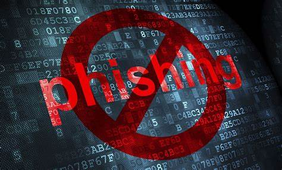

  

# 🛡️ InboxDefenders: Fortifying Your Inbox Against Phishing Attacks

Welcome to InboxDefenders, your trusted ally in the ongoing battle against phishing attacks. Our mission is simple yet vital: to provide unparalleled protection for your inbox using cutting-edge deep learning techniques.

## 🌟 About the Project

InboxDefenders represents the pinnacle of email security innovation. By harnessing the power of Doc2Vec, LSTM, and Z-Score normalization, we've created a sophisticated defense mechanism capable of identifying and neutralizing phishing threats with unparalleled accuracy.

## 🚀 Roadmap

Embark on our journey towards a safer digital world:

- **Research and Development:** Explore the frontiers of phishing detection, pushing the boundaries of deep learning to new heights.
- **Model Development:** Forge the weapons of our defense - implement Doc2Vec, LSTM, and Z-Score normalization to craft a formidable phishing detection model.
- **Evaluation:** Assess the strengths and weaknesses of our creation using confusion matrices, refining it to perfection.
- **Integration:** Seamlessly integrate InboxDefenders into your email security infrastructure, bolstering your defenses against phishing attacks.
- **Community Engagement:** Share our knowledge and insights with fellow guardians of cyberspace, fostering collaboration and growth.

## ⚙️ How It Works

InboxDefenders operates on the cutting edge of technology:

- **Doc2Vec:** Unravel the semantic mysteries of email content, transcending simple keyword matching to unveil the true intent behind every message.
- **LSTM:** Navigate the intricate web of sequential data, capturing elusive patterns and uncovering the subtle nuances of phishing behavior.
- **Z-Score Normalization:** Forge order from chaos, preprocessing and standardizing data to ensure consistency and enhance model performance.

## 🎯 Getting Started

Ready to fortify your inbox? Here's your roadmap to success:

1. **Clone the Repository:** Secure the source code from our repository - your gateway to email security.
2. **Install Dependencies:** Arm yourself with the necessary tools by ensuring all dependencies are installed.
3. **Train the Model:** Unleash the power of your dataset to train the model, honing its skills to perfection.
4. **Evaluate Performance:** Gauge the effectiveness of InboxDefenders using confusion matrices, refining its capabilities through iterative assessment.
5. **Integration:** Seamlessly integrate InboxDefenders into your email security arsenal, transforming your defenses against phishing attacks.

## 📊 Evaluation

InboxDefenders undergoes rigorous evaluation using confusion matrices, providing invaluable insights into its accuracy, precision, recall, and F1-score. This iterative process enables us to continuously refine and optimize its performance.

## 🌟 Contributors

Meet the masterminds behind InboxDefenders:

- Aakash Banavathu (abanavat@gmu.edu)
- Waleed Saeed Mushrif Alamri (walamri@gmu.edu)
- Sundeep Damirekula (sdamirek@gmu.edu)
- Mohammad H Asim (masim@gmu.edu)
- Tung Thanh Truong (ttruon3@gmu.edu)

## 🤝 Support

For any inquiries or assistance, our dedicated team stands ready to assist you. Reach out to us at inboxdefenders@gmu.edu and let's safeguard the digital realm together.

## 📜 License

N/A (License information to be updated, if applicable)
